# Hey! I'm Simo 👋

<div align="center">


</div>

---


___

## 📛 About Me

- **Name:** Mohamed, but everyone calls me **Simo**
- **Age:** 18 years old 🎂
- **Location:** Morocco 🇲🇦
- **Birthday:** June 7, 2006
- **Languages:** Arabic (native) & English (learning) 💬

## 🧠 My Story

Just a chill coder who started from nothing and kept grinding no matter what. I don't even have a PC — I've done everything from my phone using **Termux** and online tools! 📱

Game dev is my big dream, but for now I'm focused on **Python** and making useful, smart tools that actually help people. Self-taught, passionate, and always learning! 🚀

---

## 💻 My Programming Journey

```mermaid
graph LR
    A[🎮 Game Engines] --> B[🤖 Discord Bots]
    B --> C[⚙️ Automation Tools]
    C --> D[🤖 AI Projects]
    D --> E[🌐 Web Development]
    E --> F[💰 Real Services]
```



- 🎮 Started coding with game engines on mobile
- 🤖 Switched to Discord bots 'cause they were more doable on a phone
- ⚙️ Found out I love building tools and automating stuff
- 🌐 I've been building projects, learning AI, and getting into web dev lately
- 💰 I'm serious about turning my skills into real services (and income 😏)

---

## 💡 My Current Projects

<table>
<tr>
<td width="50%">

### 🧠 Seto Chan
**AI-powered Discord bot** that generates full server layouts from user prompts!

- ✅ Creates roles, channels, categories, permissions
- ✅ Includes preview system 
- ✅ Overwrites existing setup if needed
- ✅ Built for beginners and busy server owners
- ✅ Modular codebase for easy updates

</td>
<td width="50%">

### 💕 Safe and Fun Dating
**Dating server** I launched with **1000+ members**!

- ✅ Custom bot running the whole server
- ✅ Fun but safe interactions
- ✅ Zero weirdness policy
- ✅ Built from scratch by me
- ✅ Growing community

</td>
</tr>
</table>

---

## ⚙️ My Tech Stack

### 💻 Languages I Use


### 📦 Libraries & Frameworks


### 🔧 Tools I Use


---

## 📊 GitHub Stats

<div align="center">


</div>

<div align="center">

[](https://git.io/streak-stats)

</div>

---

## 🎯 What I'm Aiming For

```python
class SimoGoals:
    def __init__(self):
        self.current_goals = [
            "🌐 Learn full-stack web dev",
            "⚛️ Master React or Vue", 
            "🎬 Build a web app to stream movies + live chat with friends",
            "💰 Earn money with my AI projects",
            "🤖 Build my own AI model someday",
            "🎮 Game dev when I finally get a PC!"
        ]
    
    def chase_dreams(self):
        return "Never stop grinding! 🚀"
```

---

## 🎮 More About Me


- 🎌 I love **anime**, **movies**, and **deep convos**
- 💪 Been **working out** for over a year now 
- 🤝 I stay **loyal** to real ones and ignore the drama
- ✨ I'm all about **good vibes**, **self-growth**, and **chasing my goals**
- 🚀 I don't wait for things — **I build 'em!**

---

## 🏆 Achievements & Highlights

- 📱 **Built everything from my phone** using Termux
- 🤖 **600+ members** in my dating server
- 🧠 **AI-powered Discord bot** with advanced features
- 💻 **Self-taught** programmer with modular coding approach
- 🌍 **Representing Morocco** in the coding community

---

## 📈 Activity Graph

<div align="center">

[](https://github.com/ashutosh00710/github-readme-activity-graph)

</div>

---

## 🚀 Let's Connect!

<div align="center">

[](https://discord.gg/8debujZeaS)
[](https://setochan-website.pages.dev/)
[](https://ko-fi.com/simoo)
[](https://x.com/simor6666)
[](https://github.com/Simo665)

</div>

---

<div align="center">

### 💭 Random Dev Quote


</div>

---

<div align="center">

**Thanks for visiting my profile! 🙏**


*"From Morocco with Code"* 🇲🇦💻

</div>
